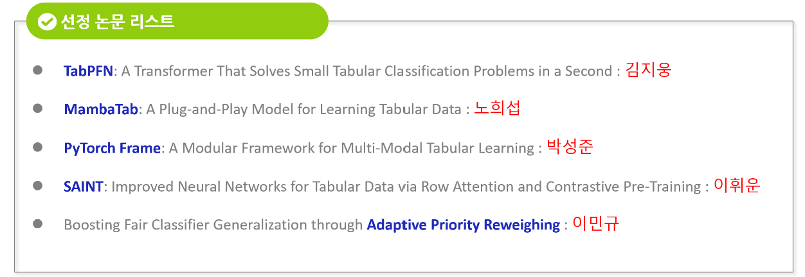

# Advanced Machine Learning Final Project Repository
  
## Semester : 2024 2nd  
## Department : Applied Data Science  
## Group : 10  

- FOCAL : 김지웅 (Project Leader)  

- Key Contributor per Model

  | Model      | Key Contributor  |
  |----------------------------------------|------------------|
  | [SAINT](saint)                                  | 이휘운          |
  | [Column-Wise Interaction Transformer)](pytorch_frame)| 박성준          |
  | [MambaTab](mambatab)                               | 노희섭          |
  | [Adaptive Priority Reweighing](adaptive)| 이민규          |

## Model Description

  

